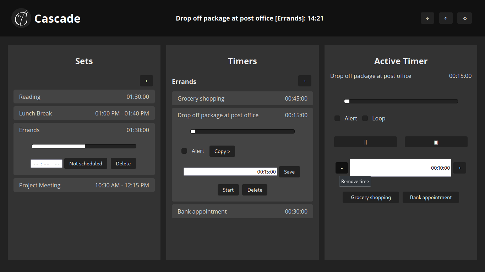

# Cascade

&nbsp;&nbsp;
&nbsp;&nbsp;

A web based multi-stage scheduler app.

## Table of Contents

-   [Cascade](#cascade)
    -   [Table of Contents](#table-of-contents)
    -   [About](#about)
    -   [Visuals](#visuals)
    -   [Features](#features)
    -   [Usage Guide](#usage-guide)
    -   [License](#license)
    -   [Acknowledgement](#acknowledgement)
    -   [Contact](#contact)

## About

**Introducing Cascade,** your FOSS, one-stop solution for conquering time and accomplishing tasks efficiently.

**Do you struggle with juggling multiple tasks and staying on schedule?**

Cascade empowers you to take control of your time with its innovative multi-stage timer system. Create sets of interconnected timers, schedule them for specific moments, and break down complex tasks into manageable steps. Use it from anywhere though the web.

**Cascade is designed to help you achieve focus, boost productivity, and finally conquer your to-do list.**

A complete list of its features can be found below.

## Visuals

## Features

**Organization and Scheduling:**

-   Create multi-stage sets of timers for complex tasks.
-   Schedule sets to run at specific times of the day.

**Easy Editing and Management:**

-   Edit any aspect of timers or sets with ease.
-   Effortlessly add or remove time from active timers.

**Progress Visualization:**

-   Track progress with intuitive progress bars on both timers and sets.

**Real-Time Updates:**

-   Dynamic tab title displays the current countdown timer for quick reference.

**Seamless Data Management:**

-   Import and export your local data for easy backup and transfer.

**Copy Mechanism:**

-   Easily copy a timer to any of the existing sets.

**Alert Notifications:**

-   Set alerts for timer completions to stay informed.

**Repeat timers in loop:**

-   Set loop for timer to restart it over and over again.

**Flexible Controls:**

-   Pause, resume, or stop timers at any time.

**Time Synchronization:**

-   Sync timers to start a scheduled set based on the current time.

## Usage Guide

**Creating Sets and Timers:**

1. Click the **+** symbol in the "Sets" column to create a new set.
2. Give your set a descriptive name by clicking on the default name and typing your desired name.
3. Timers cannot exist outside of sets. Click the **+** symbol in the "Timers" column within a specific set to create a new timer.
4. Assign a duration (e.g., 25 minutes) to your timer by clicking on the white box and entering the desired time. Click "Save" to confirm.

**Scheduling Sets:**

1. Click on the white box next to "Not scheduled" in the set you want to schedule.
2. Enter the desired start time for the set using the time input format.
3. Click the "Not scheduled" button again to toggle it to "Scheduled". The set will now activate at the designated time.

**Editing and Managing Timers and Sets:**

-   **Renaming:** Click directly on the current name of a set or timer and type the desired new name.
-   **Alerts:** Check the box next to "Alert" for a timer to ensure you receive a notification when it finishes.
-   **Editing:** Click on a timer's text input field to adjust its duration or other settings.
-   **Deleting:** Click the delete icon next to a set or timer to remove it completely.

**Running Timers:**

1. Click the "Start" button next to the timer you want to run.
2. The timer will move to the "Active Timer" column and begin counting down.

**Working with Active Timers:**

-   **Loops:** Check the box next to "Loop" for a timer to make it restart endlessly.
-   **Pause/Resume:** Click the "Pause" or "Resume" button to control the timer's progress.
-   **Stop:** Click the "Stop" button to completely end the timer and remove it from the "Active Timer" column.
-   **Adjusting Time:** Click the white box next to the current timer duration and adjust the value to add or remove time from the ongoing execution. Click "Save" to confirm the change.
-   **Skipping:** Use the "Previous" and "Next" buttons (if available) to navigate between timers within the active set.

**Reordering and Data Management:**

-   Drag and drop sets and timers within their respective columns to rearrange them according to your preference.
-   Access the export and import functions from the navbar to save and load your data sets.

**Launching Scheduled Sets:**

-   Click the "⟲" button in the navbar to instantly launch any set that is scheduled for the current time.

**App Information:**

-   Click on the title "Cascade" to open a modal displaying details about the app.

**Remember:** Timers require a set for creation. Get organized and productive with Cascade!

**Additional Notes:**

-   **Demo:** You can start personalizing it over [here](https://shashotoNur.github.io/cascade/).
-   **Sample data** The sample data from the screenshot is located in "sample/my-sets.json". You can import it into the app.

## [License](LICENSE)

## Acknowledgement

-   **[Information Bell](https://github.com/akx/Notifications/blob/master/OGG/Information_Bell.ogg)** by [akx](https://github.com/akx) has been used as the notification sound.

## Contact

